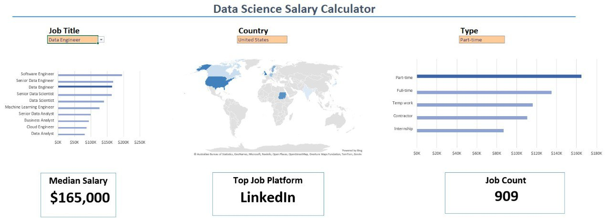
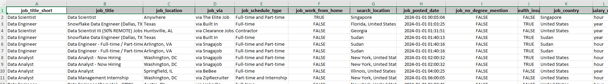
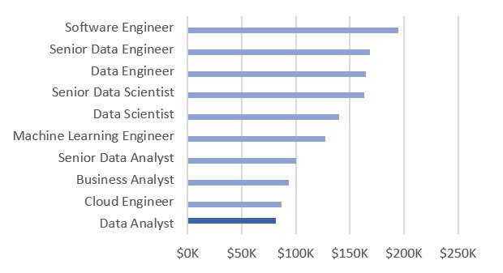
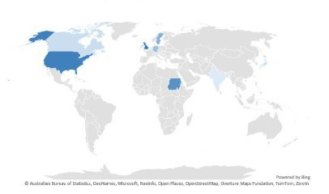
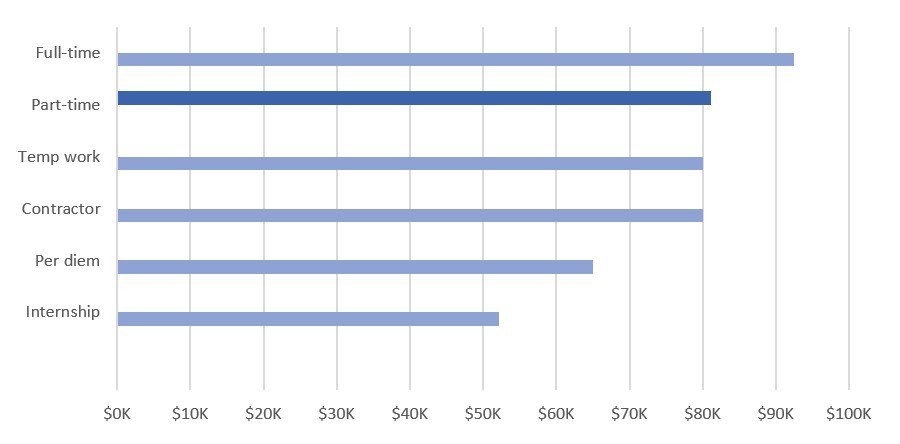
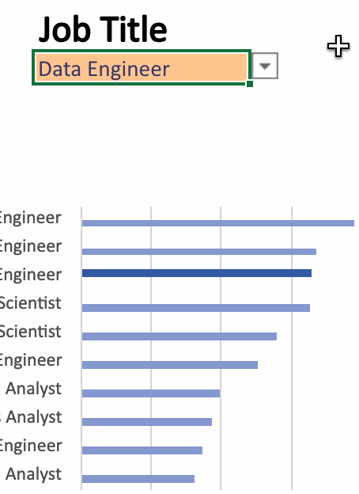
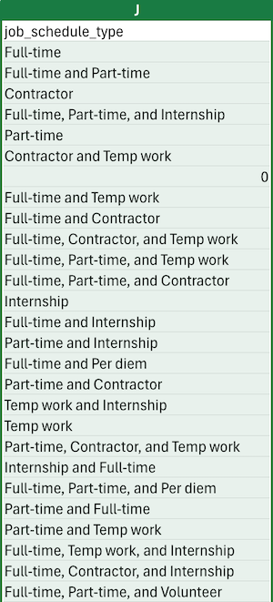

# Excel Salary Dashboard

## Introduction

I built this dashboard as part of the first project of the course [Excel for Data Analytics course](https://www.lukebarousse.com/products/excel-for-data-analytics/). The dashboard helps job seekers explore salaries for their desired positions and assess whether they are being adequately compensated. 

The dataset used for this project contains real-world data provided by the course creators. It covers the period from 2024 through June 2025 and includes over 44,000 data science job postings collected from various platforms. Each record provides information on job titles, salaries, locations, and essential skills.

### Dashboard File
My final dashboard is in [1_Salary_Dashboard.xlsx](Resources/Datasets/1_Salary_Dashboard.xlsx).

## Dashboard Build

The following Excel skills were utilised for creating the dashboard:

- **Charts**
- **Formulas and Functions**
- **Data Validation**

### Charts

#### Data Science Job Salaries - Bar Chart

- **Excel Features**: Utilised a bar chart to plot median salaries for different data science jobs. 
- **Design Choices**: A horisontal orientation of the bars was chosen to facilitate better visual comparison of salaries. The numbers on the chart axis were formatted to be displayed in a shortened form (e.g., $10,000 -> $10K) using a custom number format in Excel. 
- **Data Organisation**: The data was sorted in descending order of salary to improve readability.
- **Insights Gained**: This chart allows for quick identification of salary trends, showing that Data Science and Engineering rolese generally offer higher pay than Analyst roles, with the exception of Cloud Engineers, whose salaries are comparable to those of Data Analysts.

#### Country Median Salaries - Map Chart

- **Excel Features**: Utilised Excel's map chart feature to plot median salaries globally.
- **Data Representation**: Plotted median salary for each country with available data.
- **Insights Gained**: This map enables quick grasp of global salary disparities and highlights high/low salary regions.

#### Job Schedule Type Salaries - Bar Chart

- **Excel Features**: Utilised a bar chart to plot median salaries for different schedule types. 
- **Design Choices**: Similarly to the Data Science Job Salaries chart, I used horisontal orientation of the bars and formatted the chart axis numbers for a more concise and cleaner look of the plot.
- **Data Organisation**: The data was sorted in descending order of the median salary to improve visual analysis.
- **Insights Gained**: This chart allows for a quick comparision of median salaries across different job schedule types. It can be observed that full-time positions offer the highest salaries. Part-time, temporary and contract roles pay approximately $10K less than full-time positions. Finally, job seekers should be aware that per diem and internship roles are the lowest-paying.

### Data Validation

The user can interact with the dashboard by changing job title, country or type and explore their corresponding meadin salaries. This input is controlled through filtered lists: `Job Title`, `Country`, and `Type`. 

In order to populate the lists, we used data validation feature of Excel. The lists themselves were created by picking unique values of `job_title_short`, `job_country` and `job_schedule_type`. For example, the following formula was used to populate the `Type` list:

`UNIQUE(jobs[job_schedule_type])`

The `SORT` function was applied to the `Job Title` list to sort values in descending order of the median salary. Countries were sorted in descending order (alphabetically). And the list of job schedule types was normalised. Original data contains entries like `Full-time and Part-time` or `Part-time, Temp work, and Internship`:

The following funciton was applied to the list to normalise it: `FILTER(J2#, NOT(ISNUMBER(SEARCH("and", J2#)))*(J2#<>0))`. Note, `J2#` spilled array contains the full list of job schedule types. After the function was aplied, the list of job schedule types looks as follows:

### Formulas and Functions
For the selected `Job Title`, `Country`, and `Type` we calculated median salary. 

## Conclusion
