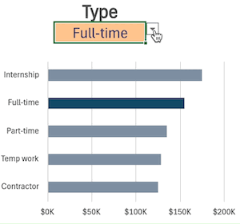

# Excel Salary Dashboard


## Introduction

I built this dashboard as part of the first project of the course [Excel for Data Analytics course](https://www.lukebarousse.com/products/excel-for-data-analytics/). The dashboard helps job seekers explore salaries for their desired positions and assess whether they are being adequately compensated. 

The dataset used for this project contains real-world data provided by the course creators. It covers the period from 2024 through June 2025 and includes over 44,000 data science job postings collected from various platforms. Each record provides information on job titles, salaries, locations, and essential skills.


### Dashboard File
My final dashboard is in [1_Salary_Dashboard.xlsx](Resources/Datasets/1_Salary_Dashboard.xlsx).

## Dashboard Build

The following Excel skills were utilised for creating the dashboard:

- **Charts**
- **Data Validation**
- **Median Salary Calculation**
- **KPI cards**

### Charts

#### Data Science Job Salaries - Bar Chart


- **Excel Features**: Utilised a bar chart to plot median salaries for different data science jobs. 
- **Design Choices**: A horisontal orientation of the bars was chosen to facilitate better visual comparison of salaries. The numbers on the chart axis were formatted to be displayed in a shortened form (e.g., $10,000 -> $10K) using a custom number format in Excel. 
- **Data Organisation**: The data was sorted in descending order of salary to improve readability.
- **Insights Gained**: This chart allows for quick identification of salary trends, showing that Data Science and Engineering rolese generally offer higher pay than Analyst roles, with the exception of Cloud Engineers, whose salaries are comparable to those of Data Analysts.

#### Country Median Salaries - Map Chart


- **Excel Features**: Utilised Excel's map chart feature to plot median salaries globally.
- **Data Representation**: Plotted median salary for each country with available data.
- **Insights Gained**: This map enables quick grasp of global salary disparities and highlights high/low salary regions.

#### Job Schedule Type Salaries - Bar Chart


- **Excel Features**: Utilised a bar chart to plot median salaries for different schedule types. 
- **Design Choices**: Similarly to the Data Science Job Salaries chart, I used horisontal orientation of the bars and formatted the chart axis numbers for a more concise and cleaner look of the plot.
- **Data Organisation**: The data was sorted in descending order of the median salary to improve visual analysis.
- **Insights Gained**: This chart allows for a quick comparision of median salaries across different job schedule types. It can be observed that full-time positions offer the highest salaries. Part-time, temporary and contract roles pay approximately $10K less than full-time positions. Finally, job seekers should be aware that per diem and internship roles are the lowest-paying.

### Data Validation

The user can interact with the dashboard by changing job title, country, or job schedule type to explore their corresponding meadian salaries. I used Excel's **Data validation** feature to control user input through predefined filtered lists : `Job Title`, `Country`, and `Type`. Below is a filtered list created for schedule types (similar steps were implemented for job titles and coutries):



To populate this list, I extracted the unique values of `job_schedule_type` using the following formula:

`=UNIQUE(jobs[job_schedule_type])`

This resulted in the following list:


For a better user experience, it was decided to **normalise** this list. The following formula was applied:

`=FILTER(J2#,(NOT(ISNUMBER(SEARCH("and",J2#))+ISNUMBER(SEARCH(",",J2#))))*(J2#<>0))`. 

- **Normalisation Rule**: Entries like "Full-time and Part-time" and "Full-time, Part-time, and Internship" are mapped to "Full-time". This is implemented using `FILTER()` combined with `NOT()`, `ISNUMBER()` and `SEARCH()` functions to exclude entries containing "and" or ",". 
- **Data Cleaning**: Some entries contain "0" as their job type. These are excluded using an additional check via array multiplication. 
- **Normalised List**:


### Median Salary Calculation

Median salaries were calculated to provide specific salary insights for the selected job titles, countries, and schedule types. For example, the formula below was used to calculate the median salary for each job title (similarly, median salaries were calculated for job titles and countries): 

```=MEDIAN(
  IF(
    (jobs[job_title_short]=A2)*
    (jobs[job_country]=country)*
    (ISNUMBER(SEARCH(type,jobs[job_schedule_type])))*
    (jobs[salary_year_avg]<>0),
    jobs[salary_year_avg]
  )
)
```
- **Data**: The values were taken from `salary_year_avg` column. Note that not all records include this data, which is why an additional check for blank salaries was added (see the next step).
- **Array Formula**: Calculates the median using MEDIAN() with a nested IF() statement to include only rows that match:
   - the job title in column `A`,
   - the country and schedule type selected by the user, and
   - non-blank salary values.
- **Job Type Partial Matching**: Note that the user selects a job schedule type from a short normalised list (see the [Data Validation](#data-validation) above). If we did strict comparison of a selected `type` against our data table, we'd lose many records. That's why we use the combination of `ISNUMBER()` and `SEARCH()` function to do partial matching.
- **Background Table**:


### KPI Cards
For the selected `Job Title`, `Country`, and `Type` we calculated median salary. 


## Conclusion
