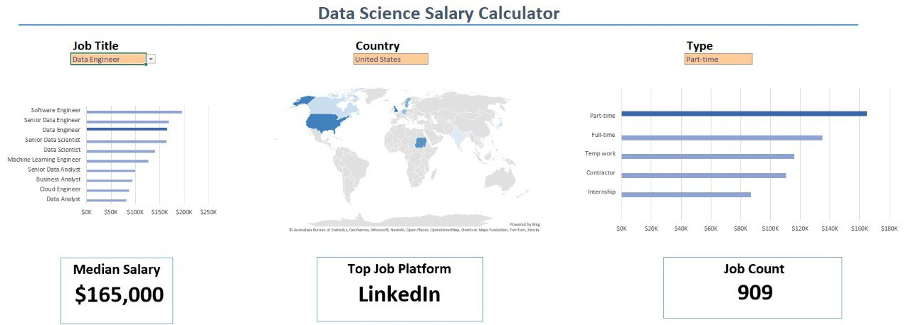
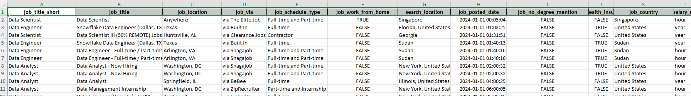
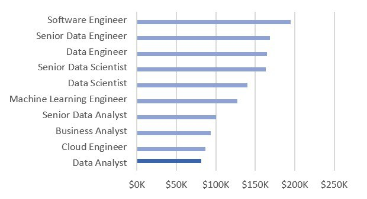
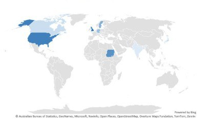
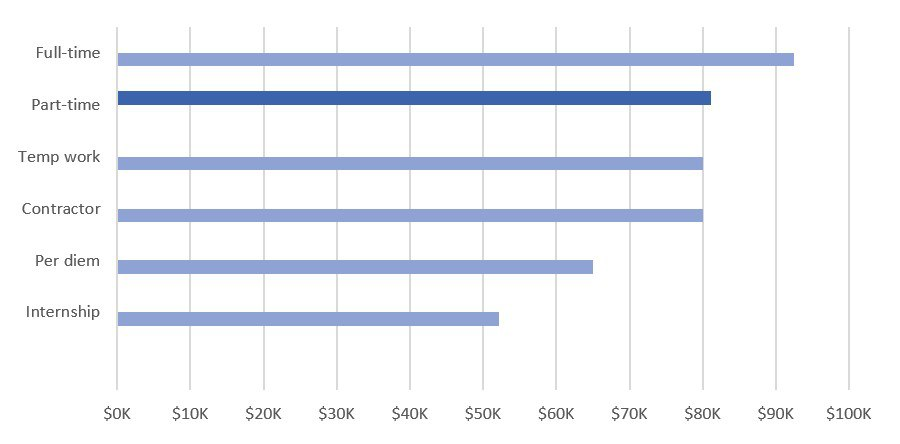
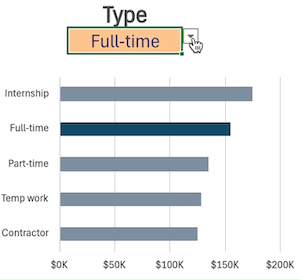
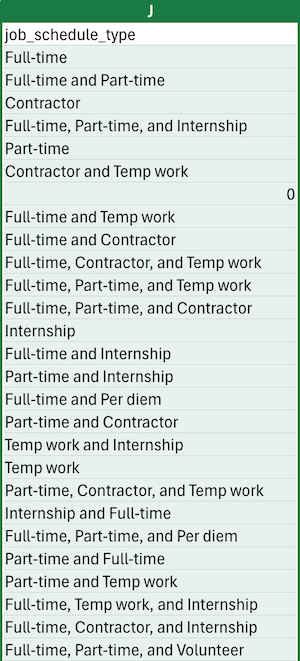
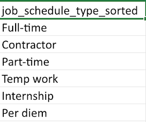
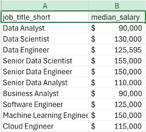
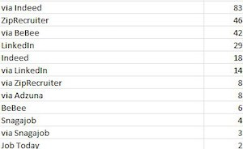

# Excel Salary Dashboard



The dashboard helps job seekers explore salaries for different data science positions and assess whether they are being adequately compensated. 

## Introduction

I built this dashboard as part of the first project of the course [Excel for Data Analytics course](https://www.lukebarousse.com/products/excel-for-data-analytics/). The course provides a solid foundation in analysing data using Excel. 

### Excel Skills Used

To create the Salary Dashboard, I used the following Excel skills:

- **Charts**
- **Formulas and Functions**
- **Data Validation**

### Data Jobs Dataset

The dataset for this project contains real-world data provided by the course creators. It covers the period from 2024 through June 2025 and includes over 44,000 data science job postings collected from various platforms. Each record contains information about job titles, salaries, locations, required skills, and more.



### Dashboard File
My final dashboard is available here: [1_Salary_Dashboard.xlsx](https://1drv.ms/x/c/92d437f0706c3869/IQAKAyCKrdUWQZ1kUfIABTOxATqV0FRqFUx3RgZEUQ5ast0?e=JD36IK).

## Dashboard Build

### Charts

#### Data Science Job Salaries - Bar Chart



- **Excel Features**: Used a bar chart to plot median salaries for different data science roles. 
- **Design Choices**: A **horizontal** bar layout supports easier comparison. Axis numbers were formatted using a custom number format to show shortened values (e.g., $10,000 → $10K).
- **Data Organisation**: Salaries were sorted in descending order for readability.
- **Insights**: Data Science and Engineering positions generally offer higher salaries than Analyst roles, with the exception of Cloud Engineers, whose salaries are close to those of Data Analysts.

#### Country Median Salaries - Map Chart



- **Excel Features**: Used the map chart to visualise median salaries globally.
- **Data Representation**: Plotted median salary for each country with available data.
- **Insights**: This map highlights salary disparities across countries and helps identify high- and low-paying regions.

#### Job Schedule Type Salaries - Bar Chart



- **Excel Features**: Used a bar chart to compare median salaries across job schedule types. 
- **Design Choices**: Similar to the job salary chart, horizontal bars were used, and axis numbers were shortened for clarity.
- **Data Organisation**: Data was sorted in descending order of the median salary.
- **Insights**: Full-time roles offer the highest salaries. Part-time, temporary, and contract positions pay roughly $10K less. Per diem and internship roles are the lowest-paying.

### Data Validation

Users can interact with the dashboard by selecting a job title, country, or job schedule type to explore corresponding median salaries. Excel's **Data validation** was used to control input through predefined filtered lists ()`Job Title`, `Country`, and `Type`).

For example, below is a filtered list for job schedule types (similar steps were used for job titles and coutries):



To populate the list, unique values of `job_schedule_type` were extracted:

`=UNIQUE(jobs[job_schedule_type])`

Resulting in the following list:



For a better user experience, the list was **normalised** using:

`=FILTER(J2#,(NOT(ISNUMBER(SEARCH("and",J2#))+ISNUMBER(SEARCH(",",J2#))))*(J2#<>0))`. 

- **Normalisation Rule**: Entries such as "Full-time and Part-time" and "Full-time, Part-time, and Internship" were mapped to "Full-time" using `FILTER()`, `NOT()`, `ISNUMBER()` and `SEARCH()` functions to exclude entries containing "and" or ",". 
- **Data Cleaning**: Entries containing "0" were excluded using an additional check via array multiplication. 
- **Normalised List**:



### Median Salary Calculation

Median salaries were calculated for each selected job titles, country, and schedule type. For example, the formula below computes the median salary for each job title (a similar approach was used for countries and schedule types): 

```=MEDIAN(
  IF(
    (jobs[job_title_short]=A2)*
    (jobs[job_country]=country)*
    (ISNUMBER(SEARCH(type,jobs[job_schedule_type])))*
    (jobs[salary_year_avg]<>0),
    jobs[salary_year_avg]
  )
)
```
- **Data**: Values come from the `salary_year_avg` column. A check excludes blank salary entries. (see the next step).
- **Array Formula**: Calculates the median for rows that match:
   - the job title in column `A`,
   - the selected country and schedule type,
   - non-zero salary values.
- **Job Type Partial Matching**: Because users select from a normalised list (see the [Data Validation](#data-validation)), partial matching using `ISNUMBER(SEARCH())` ensures valid mapping.
- **Background Table**:



### KPI Cards

Three KPIs Cards were implemented for the dahsboard: **Median Salary**, **Top Job Platform** and **Job Count**. They were implemented using linked to Excel cells.

#### Median Salary and Job Count

Both KPIs use the `XLOOKUP()` function. 
For example, the median salary for the selected job title is returned using: 

`=XLOOKUP(title, D2:D11, E2:E11, "No results")`

- **Function Purpose**: Looks up the selected job title in the job title array (`D2:D11`) and returns the corresponding median salary from the return array (`E2:E11`) or "No Results" if the value is not found.

- **Insights**: The Median Salary card highlights a key compensation metric for the selected role.

#### Top Job Platform

To identify the most common job platform, three steps were used:

1. Count job postings:

`=COUNTIFS(jobs[job_via], A2, jobs[job_title_short], title, jobs[job_country], country, jobs[job_schedule_type], type)`

- **Formula Purpose**: The formula counts job offers from each platform matching the selected job title, country and schedule type.

2. Sort platforms by count:

`=SORT(A:B831, 2, -1)`

- **Formula Purpose**: The formula sorts platfroms and job counts in descending order. 
- **Background Table**: 



3. Clean the platform name:

`=SUBSTITUTE(D2, "via", "")`

- **Formula Purpose**: The formula excludes "via" from the platform's name.

## Conclusion

I created this dashboard as part of the [Excel for Data Analytics course](https://www.lukebarousse.com/products/excel-for-data-analytics/). 
In this project, I used Excel charts, formulas, functions and data validation.
The dashboard provides insights into salary trends across job titles, countries, and schedule types. 
The dataset, provided by the course organisers, includes recent data from 2024 through June 2025.
With the dashboard, users can compare salary offers for different job titles, vusualise salaries geographically, and explore how job schedule types affect compensation.