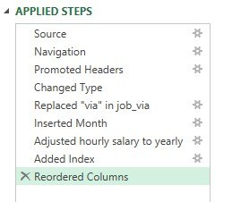
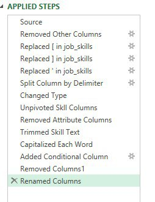
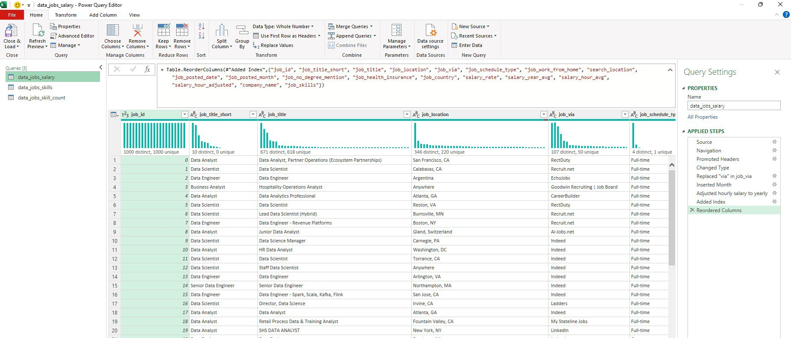
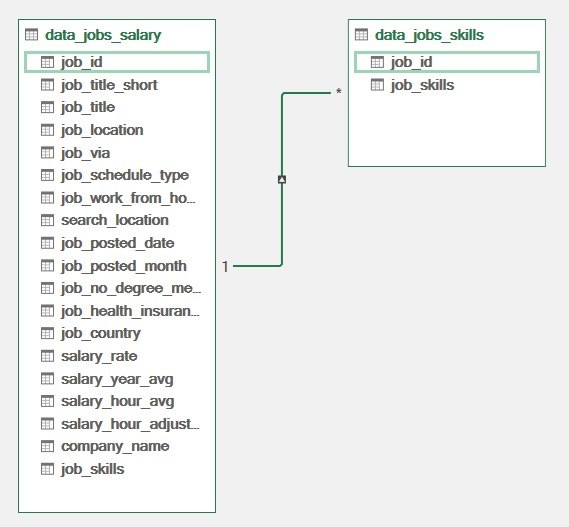
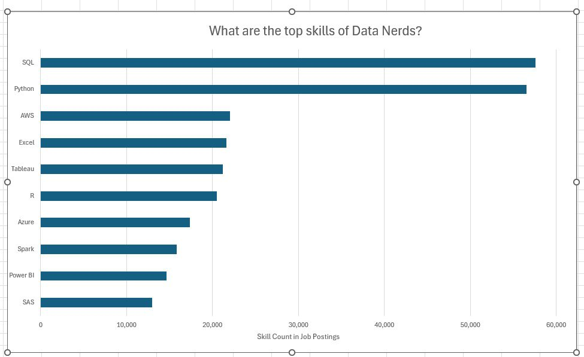
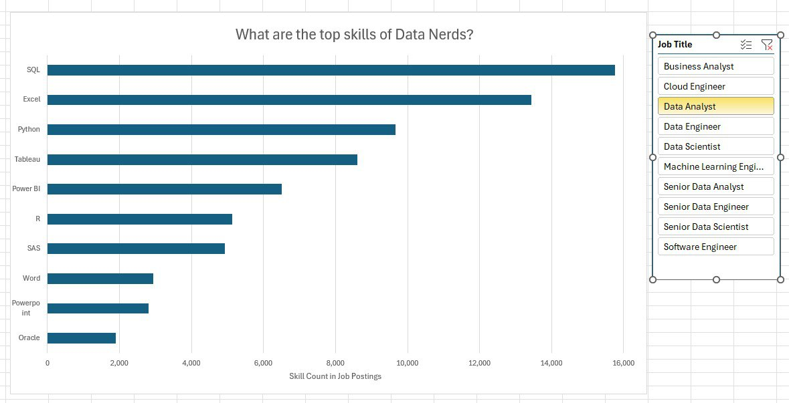
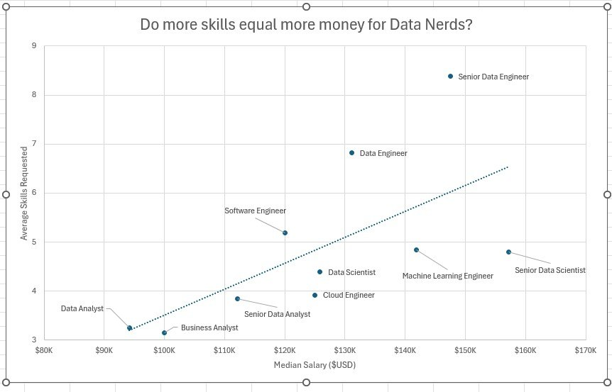
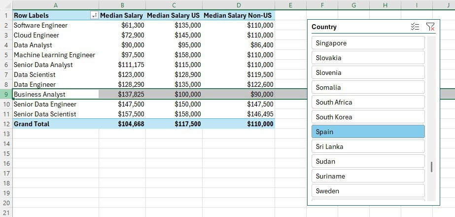
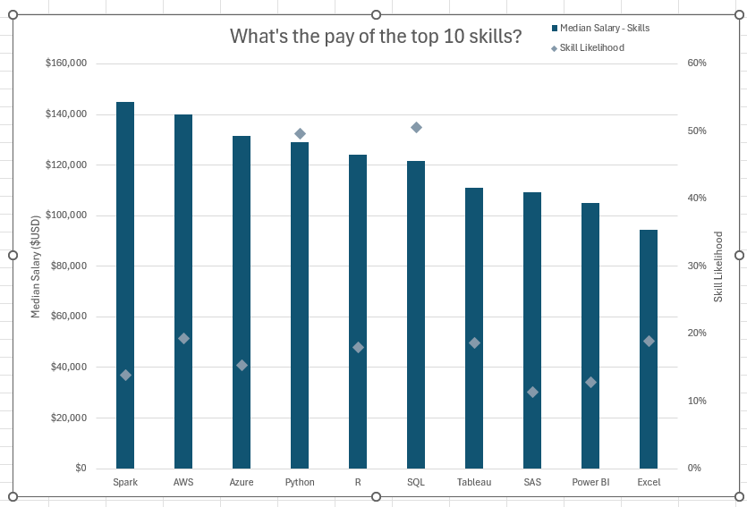

# Project 2 Analysis

This page describes analysis of [the data science jobs dataset](../README.md#the-data-jobs-dataset) that was performed as part of the second project in the [Excel for Data Analytics course](https://www.lukebarousse.com/products/excel-for-data-analytics/). 

I set out to understand what skills top employers request and how to land more pay. The following questions guided my analysis:

1. **What are the top skills of data professionals?**
2. **Do more skills get you better pay?**
3. **What’s the salary for data jobs in different regions?**
4. **What’s the pay and likelihood of the top 10 skills?**

## Excel Skills Used

I used the following Excel skills for the project:

- **Power Query**
- **Pivot Tables**
- **Pivot Charts**
- **DAX (Data Analysis Expressions)**
- **Power Pivot**

## Data preparation/ETL with Power Query

### Extract

I first used Power Query to extract the original data from the [job dataset](../README.md#the-data-jobs-dataset). The original data is provided in an Excel workbook. I created two queries:
- First one with all the data jobs information.
- The second listing only the skills for each job ID.

### Transform

Then, I transformed each query by changing column types, removing unnecessary columns, adding index, cleaning text to eliminate specific words, and trimming excess whitespace. Below are two snippets illustrating all the transformation steps performed on the queries:
- data_jobs_salary

    

- data_job_skills

    

### Load

Finally, I loaded both transformed queries into the workbook, setting the foundation for my subsequent analysis.

- data_jobs_salary

    

- data_job_skills

    


## Data Analysis

### 1️⃣ What are the top skills of data professionals?/ Data models with Power Pivot

I integrated `data_jobs_salary` and `data_jobs_skills` tables into a single model using Power Pivot, and created a relationship between these two tables using the `job_id` column.



For the analysis, I loaded the data into a PivotChart. The data has been sorted in descending order by job skill count and only the top 10 skills were retained for the analysis:



#### Insights

Understanding prevalent skills in the industry not only helps professionals stay competitive but also guides training and educational programs to focus on the most impactful technologies:
- SQL and Python dominate as top skills in data-related jobs, reflecting their foundational role in data processing and analysis.
- Emerging technologies such as AWS and Azure also show a significant presence, underlining the industry's shift towards cloud services and big data technologies.

Thanks to our data model, we can examine the relationship between the `data_jobs_salary` and `data_jobs_skills` tables, and focus our analysis on a specific data science job title. This can be done using a **Job Title slicer** that filters the data by `job_title_short` from the `data_jobs_salary` table. For example, the screenshot below shows the top 10 skills for a **Data Analyst**:



#### Insights

- It is notable that for data analysts, SQL and Python remain among the top three required skills; however, Excel becomes second most important skill replacing AWS that was in the top 3 skills of a collective *Data Nerd* professional. 
- Another eye-catching difference is that technical skills such as AWS, Azure, and Spark do not appear among the top 10 skills for data analysts. At the same time, knowledge of Power BI becomes more relevant for data analysts.

### 2️⃣ 2 Do more skills get you better pay?/ DAX for explicit measures

To answer this question, we esentially need two measures: skills count and median salary for each job title. In Excel there are two ways to calculate such measures: implicit and explicit. I used DAX aggregation functions available through Power Pivot to add explicit measures to our data model. Below are the formulas that defined the two measures we needed for the analysis, `Skills Per Job` and `Median Salary`:

- `Job Count:=DISTINCTCOUNT(data_jobs_salary[job_id])` 
Counts how many job postings there are in the `data_jobs_salary` table.

- `Skill Count:=COUNT(data_jobs_skills[job_skills])`
Counts how many skills there are in the `data_jobs_skills` table.

- `Skills Per Job:=DIVIDE([Skill Count], [Job Count])`

- `Median Salary:=MEDIAN(data_jobs_salary[salary_year_avg])`

Finally, I represented the two measures, `Skills Per Job` and `Median Salary`, in a scatter plot: 



#### Insights

- There is a positive correlation between the number of skills requested in job postings and the median salary.
- Roles that require fewer skills, like **Data Analyst**, **Business Analyst** or **Senior Data Analyst**, tend to offer lower salaries, suggesting that more specialized skill sets command higher market value.
- This trend emphasizes the value of acquiring multiple relevant skills, particularly for individuals aiming for higher-paying roles.

### 3️⃣ What’s the salary for data jobs in different regions?/ PivotTables and DAX

The data needed to answer this question is stored in the `data_jobs_salary` table, which was previously loaded into the data model. To analyse this data, I created a PivotTable, and placed the `job_title_short` in the **Rows** area and `salary_year_avg` into the **Values** area.

A `Median Salary` explicit measure had already been created (see analyss [here](#2️⃣-2-do-more-skills-get-you-better-pay-dax-for-explicit-measures). This measure calculates the median salary for different job titles. I also added a slicer on the `job_country` field to examine median salary across countries. However, the slicer displays only a single median salary for the selected country or group of countries.

To enable a more comparitive analysis, I added two additional measures to the `data_jobs_salary` table: `Median Salary US` and `Median Salary Non-US`.

- `Median Salary US` calculates the median salary for jobs in the United States; it is defined using the following DAX Formula:
    ```
    =CALCULATE(
        [Median Salary],
        data_jobs_salary[job_country] = "United States")
    ```

- `Median Salary Non-US` calculates the median salary for jobs in all other countries; it is defined using the following DAX Formula:
    ```
    =CALCULATE(
        [Median Salary],
        data_jobs_salary[job_country] <> "United States")
    ```

The screenshot below shows the PivotTable created for this analysis. It lists all job titles along with three salary measures calculated for each title: `Median Salary`, `Median Salary US` and `Median Salary Non-US`. The table is sorted by `Median Salary` values in ascending order.

The slicer connected to the table has `Spain` selected, which filters the `Median Salary` measure to values relevant only to job postings in Spain.



#### Insights

-  Job roles such as **Senior Data Engineer** and **Senior Data Scientist** command higher median salaries in Spain. These roles also rank among the highest-paying positions in both the US and international markets, highlighting the global demand for advanced data expertise.
- Salary disparities between the US, international markets, and Spain are particularly pronounced in technical roles such as **Software Engineer**, **Cloud Engineer**, and **Machine Learning Engineer**. In Spain, professionals in these positions are offered several thousand dollars less than their counterparts in the US and other countries.
- The only role that offers higher median salary in Spain compared to both the US and other countries is **Business Analyst**.
- These salary insights are valuable for career planning and salary negotiations, helping both professionals and organisations align compensation with market standards while accounting for geographical differences.

### 4️⃣ What’s the pay and likelihood of the top 10 skills?/ PivotCharts and DAX

To answer this question, we need two types of data: the skill count and the median salary for each skill. This data are organised into two tables: `data_jobs_salary` and `data_jobs_skills`. The two tables are related by `job_id` (see analysis in [this Section](#1️⃣-what-are-the-top-skills-of-data-professionals-data-models-with-power-pivot)).

Median Salary was added as an explicit measure to `data_jobs_salary` and is described in [this analysis](#2️⃣-do-more-skills-get-you-better-pay-dax-for-explicit-measures).

Likelihood represents the probability of a skill appearing in a job. I define it as the ratio of the `Skill Count` to the `Job Count` - two explicit measures whose computation is described in [this analysis](#2️⃣-do-more-skills-get-you-better-pay-dax-for-explicit-measures)).

`Ratio = Skill Count / Job Count`

The corresponding DAX formula is:

`DIVIDE([Skill Count], [Job Count])`

For visual analysis, I created a combo PivotChart in which `Median Salary` is plotted on the **primary axis** as a clustered column, while `Skill Likelihood` is plotted on the **secondary axis** as a line with markers. Below is a screenshot of the chart:



#### Insights

- Higher median salaries are associated with skills such as Spark, AWS, and Azure, suggesting their critical role in high-paying tech jobs. This indicates that employers are willing to pay more for professionals who can design, operate, and optimize data systems at scale. 
- When examining skill likelihood, it is notable that nearly 50% of job postings mention Python and/or SQL. At the same time, these skills are clearly linked to high-paying roles. This highlights the importance of investing time in learning them, especially for those looking to enter the job market and maximise their earning potential.
- Finally, skills such as Power BI and SAS show both lower median salaries and lower likelihoods, indicating weaker demand in high-salary segments of the market.

## Conclusion

As a current job seeker, I embarked on this Excel-based project to uncover valuable insights into the data science job market. Using a dataset that was provided by the creators of the [Excel for Data Analytics course](https://www.lukebarousse.com/products/excel-for-data-analytics/), I analysed job titles, salaries, locations, and essential skills. By leveraging Excel features such as PivotTables, PivotCharts, Power Query, Power Pivot, and DAX, I identified key correlations between in-demand skills and higher salaries &mdash; particularly in Python, SQL, and cloud technologies. 