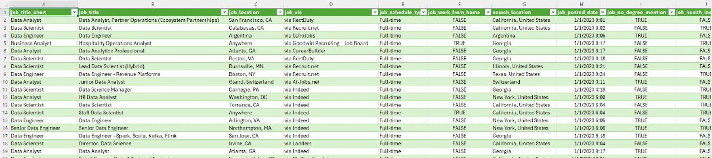

# My Excel Data Analytics Projects

This repo contains two projects that I implemented as part of the course [Excel for Data Analytics](https://www.lukebarousse.com/products/excel-for-data-analytics/).  

## Salary Dashboard  

In this project I have created a dashboard to help job seekers investigate salaries for their desired jobs and ensure they are being adequately compensated.  

[Checkout my work here](Project_1-Dashboard)  

## Salary Analysis  

In this project I have explored the most optimal jobs and skills in the data science market. 

[Checkout my work here](Project_2-Analysis)

## The Data Jobs Dataset

The dataset for both projects contains real-world data provided by the course creators. It covers the period from 2024 through June 2025 and includes over 44,000 data science job postings collected from various platforms. Each record contains information about job titles, salaries, locations, required skills, and more.

Below is the snippet of the dataset.

